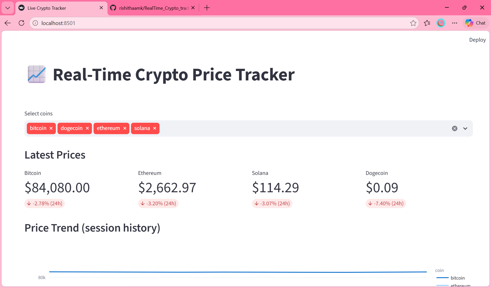
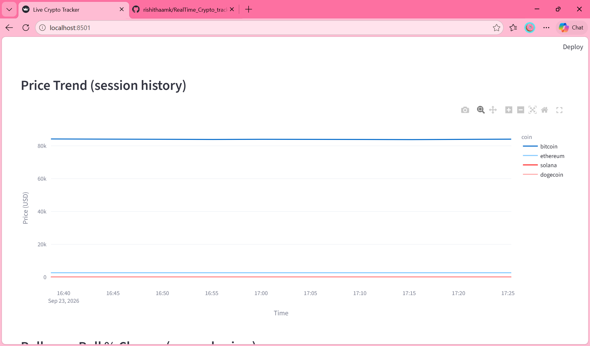
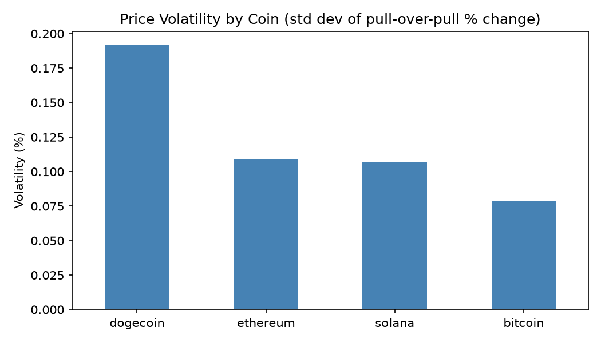
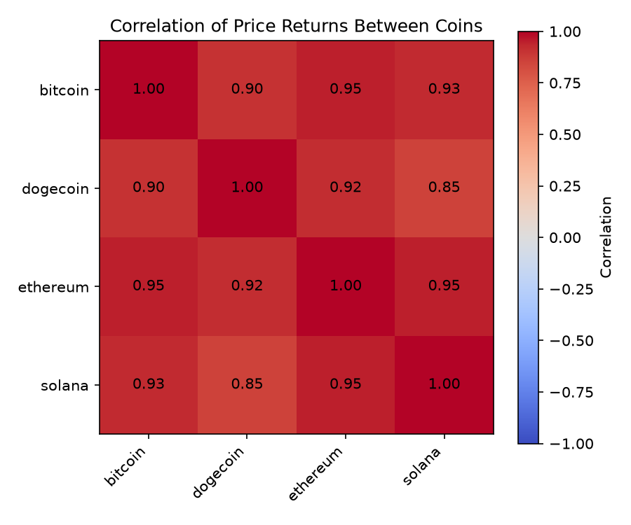

# Real-Time Crypto Price Tracker

A live data pipeline, dashboard and analysis project for a Data Analyst portfolio. It pulls live prices for bitcoin, ethereum, solana and dogecoin every 5 minutes, stores them in SQLite, flags sudden price moves as anomalies, and shows everything on an auto-refreshing Streamlit dashboard. A Jupyter notebook analyses the collected data.

**Live dashboard:** (https://realtimecryptotracker-74gh8wn9vxtkznmfaxzp3c.streamlit.app/)

## Dashboard

## Analysis findings (analysis.ipynb)
- **Volatility:** dogecoin was the most volatile coin (~0.19% std dev per pull) and bitcoin the least (~0.08%).
- **Correlation:** all four coins moved closely together (0.85 to 0.95), so holding them together gives little diversification.
- **Anomalies:** no move crossed the 3% threshold in about 1.5 hours of continuous data. The largest was dogecoin at +0.78%.

## Project files
- `db_setup.py`: creates the SQLite database and table
- `ingest.py`: pulls live prices from CoinGecko every 5 minutes and stores them
- `dashboard.py`: Streamlit dashboard (latest prices, price trend, anomaly table, raw data)
- `analysis.ipynb`: volatility, correlation and anomaly analysis
- `requirements.txt`: Python packages needed

## How to run locally
1. Install Python 3.9 or newer.
2. Create and activate a virtual environment: `python -m venv venv`, then `venv\Scripts\activate` (Windows) or `source venv/bin/activate` (Mac/Linux).
3. Install packages: `pip install -r requirements.txt`
4. Create the database: `python db_setup.py`
5. Start data collection (leave it running): `python ingest.py`
6. In a second terminal, start the dashboard: `streamlit run dashboard.py` (opens at http://localhost:8501 and refreshes every 30 seconds).
7. To analyse the data, open `analysis.ipynb` in Jupyter and run all cells. Let `ingest.py` run for at least an hour first.

## Notes
- The deployed Streamlit version fetches live data directly. The notebook reads the local `crypto_prices.db` file, so it works with the local setup.
- One overnight gap in data collection was removed before analysis, so only continuous data is used.

## Limitations
Results are based on about 1.5 hours of continuous data, so they are indicative rather than conclusive.

## Tech stack
Python, pandas, SQLite, Streamlit, matplotlib, Jupyter, CoinGecko APIvthin limits.
- **`ModuleNotFoundError`** → make sure your virtual environment is
  activated before running `pip install` and before running the scripts.
